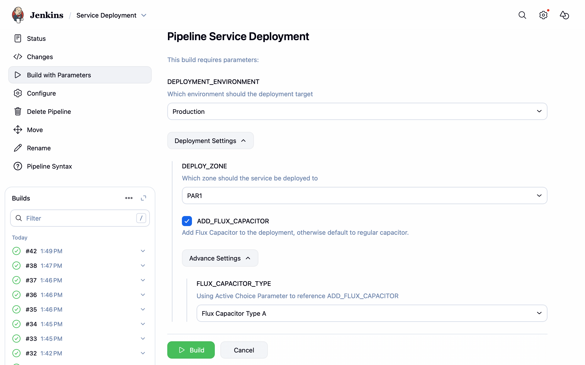

# Parameter Group Plugin

A Jenkins plugin that lets you group related build parameters together under a collapsible label in the job's build form. 



> [!WARNING]
> The plugin has been tested with the build-in Jenkins parameters, but other parameters or combinations of, may not work as intended.


## What it does

When a job has many parameters, the build form can become hard to navigate. This plugin adds a **Parameter Group** parameter type that wraps any number of child parameters into a named, collapsible section. The child parameters behave exactly as they would ungrouped — their values are injected into the build environment as normal environment variables.

## Configuration

In your job's configuration, add a **Parameter Group** parameter and fill in:

| Field | Description |
|---|---|
| **Name** | Internal identifier for the group (used in the build environment) |
| **Group Label** | Display name shown as the collapsible section heading |
| **Description** | Optional description |
| **Collapsed by default** | Whether the section starts collapsed on the build form |
| **Parameters** | The child parameters to include in the group |

Any parameter type (String, Choice, Boolean, etc.) can be added as a child parameter.

## Usage

Child parameters are exposed as regular environment variables in the build, regardless of nesting. A group containing `DEPLOY_ENV=production` and `REGION=us-east-1` makes both variables available to build steps exactly as if they had been defined at the top level.

### Pipeline

For Pipeline jobs, pass the group value using `ParameterGroupValue` or trigger builds with `parameters` using the child parameter names directly.

```groovy
// It's possible to loop over all the child parameters using the param group
script {
    params.ADVANCE_PARAMETER_GROUP.each { param ->
        println "${param.name}=${param.value}"
    }
}
```

### Job DSL

```groovy
parameters {
    parameterGroup(name: 'deployConfig', groupLabel: 'Deploy Configuration') {
        stringParam('DEPLOY_ENV', 'staging', 'Target environment')
        stringParam('ZONE', 'PAR1', 'Deployment Zone')
    }
}
```

## Contributing

Refer to our [contribution guidelines](https://github.com/jenkinsci/.github/blob/master/CONTRIBUTING.md)

## LICENSE

Licensed under MIT, see [LICENSE](LICENSE.md)
